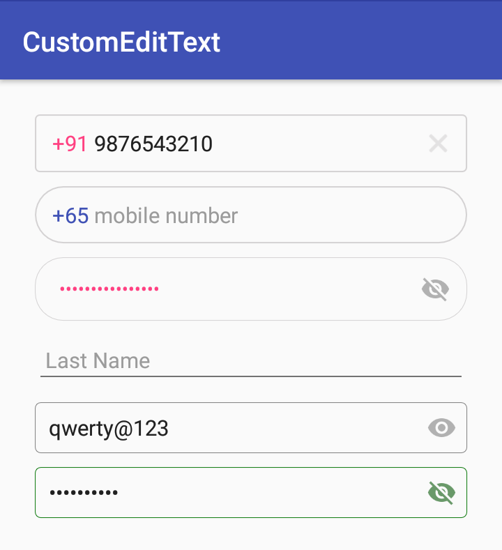

# CustomEditText
A Collection of features are implemented in single editext view. By adding one line code in xml to access features like rounded corner, clear icon visibility when typing, password visibility when inputtype is password.

# Features
1.EditText shape  -> rounded corder with radius and changing BG color, Border color.     
2.Clear icon visibility when typing   
3.Font change via xml     
4.Password visibility icon when inputtype in password mode.      
5.Able to change Tint color of icons.  
    
the above features are done through xml file.    

<a href="http://www.methodscount.com/?lib=com.libizo%3Acustomedittext%3A1.0.2"></a>

<a href="http://www.methodscount.com/?lib=com.libizo%3Acustomedittext%3A1.0.2"></a>



# Usage
To add CustomEditText into your project, import .aar as module or add through to gradle. 


Add it in your app build.gradle at the end of repositories if not present in gradle file:

```

# Gradle Depedencies :

dependencies {
    compile 'com.libizo:customedittext:1.0.2'
}

Note : use "implementation" instead of "compile" in dependencies section.
       "compile" is deprecated in android studio 3+ versions. 


```
# Import as Module

[Donwload module])https://github.com/Rajagopalr3/CustomEditText/blob/master/customedittext-1.0.2.aar

# XML

```
 <com.libIZO.CustomEditText
            android:layout_width="match_parent"
            android:layout_height="wrap_content"
            android:layout_margin="5dp"
            android:hint="First Name"
            android:inputType="text"
            android:text="Raja"
            app:libIZO_clearIconTint="#8f1f15"
            app:libIZO_setBorderColor="#8f1f15"
            app:libIZO_setBorderView="true"
            app:libIZO_setClearIconVisible="true"
            app:libIZO_setCornerRadius="4dp"
            app:libIZO_setStrokeWidth="2dp" />

                      
```


# Set Font
  Add your font files into assets folder. In string.xml files find your font files like below

```
    <string name="DroidSansBold">DroidSans-Bold.ttf</string>
    
```


# Attributes

 |        Attributes               |            Description            |         Default Value         |
 | ------------------------------- | -------------------------------   | --------------------------    |
 | libIZO_setBorderView            | if true rectangle view enabled    |  false in default             |
 | libIZO_setBorderColor           | set border color of edittext      |  grey color in default        |
 | libIZO_setStrokeWidth           | set border width in dp            |  1 dp in default              |
 | libIZO_setBackgroundColor       | set BG color of edittext          |  transparent color in default |
 | libIZO_setCornerRadius          | set corner radius of edittextview |  1 dp in default              |
 | libIZO_setFont                  | set font name in string           |  android's default font       |
 | libIZO_setClearIconVisible      | if true clear icon is enabled     |  false in default             |
 | libIZO_clearIconTint            | set clear icon tint color         |  grey color in default        |
 | libIZO_hideShowPasswordIconTint | set password icon tint color      |  grey color in default        |
    
    
 # License
 
 ```
 
Copyright 2017 Rajagopal

Licensed under the Apache License, Version 2.0 (the "License");
you may not use this file except in compliance with the License.
You may obtain a copy of the License at

   http://www.apache.org/licenses/LICENSE-2.0

Unless required by applicable law or agreed to in writing, software
distributed under the License is distributed on an "AS IS" BASIS,
WITHOUT WARRANTIES OR CONDITIONS OF ANY KIND, either express or implied.
See the License for the specific language governing permissions and
limitations under the License.
 
```  
    
